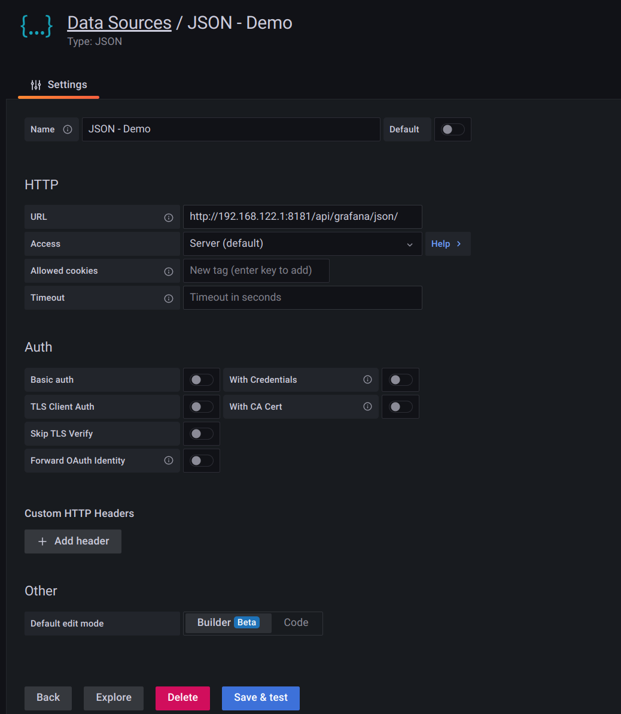

# Run the demo service of builder mode

1. [download](https://go.dev/dl/) and install `go compiler`
2. Run the demo application
```bash
go run main.go
```
3. Add a data source in grafana. The URL value is the address of the demo service, for example: `http://192.168.122.1:8181/api/grafana/json/ `
4. *[Optional]* Modify `Default edit mode` to `Builder`

like this

